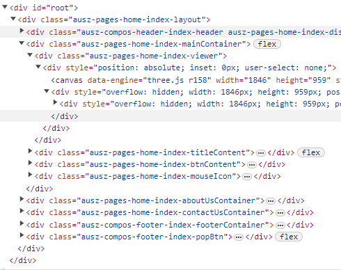
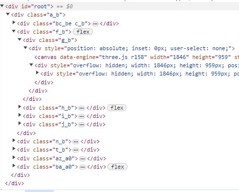

# 压缩 ClassName

标签：`Webpack4` `ClassName`

## 背景

开发环境中，为了方便调试和检查样式，会使用有语义的 ClassName

但这样的类名所带来的问题是类名过长，对于生产环境时不必要的，而且会增大 CSS 的体积

固尝试在编译时根据环境不同采用不同的命名方式以实现性能优化

## 实现

webpack 打包过程中，通过自定义 `css-loader` 的 `getLocalIdent` 参数实现自定义类名

定义类名生成函数 `generateScopedName` 如下：

``` typescript

const slash = require('slash');
// 短 id 生成器
const createUniqueIdGenerator = require('./createUniqueIdGenerator.js');

const uniqueIdGenerator = createUniqueIdGenerator();

function generateScopedName(name, file) {
  if (file.includes('node_modules') || file.endsWith('global.less')) {
    // 排除三方样式
    return name;
  }
  const isProd = process.env.REACT_APP_ENV === 'none';
  if (isProd) {
    // 生产环境生成短类名
    return uniqueIdGenerator(name) + '_' + uniqueIdGenerator(file);
  }
  // 开发环境根据文件路径和文件名生成有语义的类名
  const match = file.match(/src(.*)/);
  if (match && match[1]) {
    const relativePath = match[1].replace('.less', '');
    const arr = slash(relativePath)
      .split('/')
      .map((a) => a.replace(/([A-Z])/g, '-$1'))
      .map((a) => a.toLowerCase());
    return `${arr.join('-')}-${name}`.replace(/--/g, '-');
  }
  return name;
}

```

参考 [instr](https://github.com/anatol-grabowski/incstr) 的实现方式生成增量字符串，`createUniqueIdGenerator` 实现如下

``` typescript

// id 的素材
const DefaultAlphabet = 'ABCDEFGHIJKLMNOPQRSTUVWXYZabcdefghijklmnopqrstuvwxyz0123456789';

const DefaultNumLike = false;

/**
 * @see https://github.com/anatol-grabowski/incstr
 * @description Increment strings or generate sequential string ids in node.js or browser
 */
function incstr(str, alph = DefaultAlphabet, numlike = DefaultNumLike) {
  if (!str) return alph[0]; // if (str === '') is excessive

  // convert to array of digits
  const digs = str.split('').map((ch) => alph.indexOf(ch));

  // increment digits starting from the rightmost
  const maxDigit = alph.length - 1;
  for (var i = digs.length - 1; i >= 0; i--) {
    // !!! var not let
    if (digs[i] === -1)
      throw new RangeError(`Character "${str[i]}" is not in the alphabet "${alph}"`);
    if (digs[i] === maxDigit) {
      digs[i] = 0;
      continue;
    }
    digs[i]++;
    break;
  }
  if (i < 0) {
    digs.unshift(numlike ? 1 : 0);
  } // add new digit

  // convert back to string
  return digs.map((dig) => alph[dig]).join('');
}

// prefix and suffix don't make sense here cause str = incstr('id3') will produce 'idid4'

// generator syntax would be too cumbersome 'nextId.next().value'
incstr.idGenerator = function ({
  lastId = '',
  alphabet = DefaultAlphabet,
  numberlike = DefaultNumLike,
  prefix = '',
  suffix = '',
} = {}) {
  let digs;
  const maxDigit = alphabet.length - 1;
  function nextId() {
    for (var i = digs.length - 1; i >= 0; i--) {
      // !!! var not let
      if (digs[i] === -1)
        throw new RangeError(`Character "${lastId[i]}" is not in the alphabet "${alphabet}"`);
      if (digs[i] === maxDigit) {
        digs[i] = 0;
        continue;
      }
      digs[i]++;
      break;
    }
    if (i < 0) {
      digs.unshift(numberlike ? 1 : 0);
    } // add new digit
    return prefix + nextId.lastId + suffix;
  }
  Object.defineProperty(nextId, 'lastId', {
    get: function () {
      return digs.map((dig) => alphabet[dig]).join('');
    },
    set: function (val) {
      digs = val.split('').map((ch) => alphabet.indexOf(ch));
    },
  });
  nextId.lastId = lastId;
  return nextId;
};

const createUniqueIdGenerator = () => {
  const index = {};

  const generateNextId = incstr.idGenerator({
    // Removed "d" letter to avoid accidental "ad" construct.
    // @see https://medium.com/@mbrevda/just-make-sure-ad-isnt-being-used-as-a-class-name-prefix-or-you-might-suffer-the-wrath-of-the-558d65502793
    alphabet: 'abcefghijklmnopqrstuvwxyz0123456789',
  });

  return (name) => {
    if (index[name]) {
      return index[name];
    }

    let nextId;

    do {
      // Class name cannot start with a number.
      nextId = generateNextId();
    } while (/ ^ [0-9].*/.test(nextId));

    index[name] = nextId;

    return index[name];
  };
};

```

## 效果对比

<div style="text-align:center">
 
</div>
