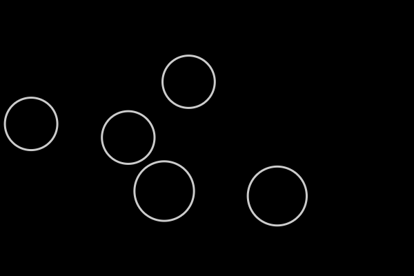
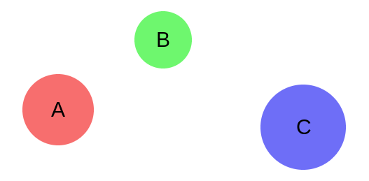

# 碰撞检测算法

标签：`算法` `游戏`

当我想要快速的实现游戏的碰撞检测时，`Sweep-and-prune` 是我的首选算法，我觉得他是一个很精彩和优雅的算法，所以写下了这篇文章。

这篇文章会有点长，并且夹杂了众多的案例和说明，可以分为两个版本，本文属于简化版本

关于这篇文章的剩余部分，我试图描绘出我脑海中的第一原则，并且通过一些可交互的 demo 进行展示，那么开始吧


## 碰撞检测

众所周知，碰撞检测在视频游戏编程 ( 如马里奥 ) 中十分常见，在实现某些游戏机制或者仿生功能上，它是一个先决条件

这些机制包括：防止角色穿透之间的穿透，`goombas` 在撞到时转身，`agar.io` 里大细胞吞噬小细胞，或者一些其它的游戏物理现象，所有的这些都需要某种碰撞检测来做支撑

在此我会从最简单的开始来介绍几种相关的方法，然后逐步拓展到 `Sweep-and-prune` 算法，并且不会涉及到空间分区和空间树切分这些

在这篇文章中，我将使用以下的刚体球模型做案例来演示整个算法



## 粗暴的做法

最直接的方法就是测试物体的每一部分是否产生碰撞，也就是说，将每个球和其它的球做一次碰撞计算

```javascript
// for each ball
for (let i = 0; i < balls.length; i++) {
  const ball1 = balls[i];
  // check each of the other balls
  for (let j = i + 1; j < balls.length; j++) {
    const ball2 = balls[j];
    // check for collision
    if (intersects(ball1, ball2)) {
      bounce(ball1, ball2);
    }
  }
}
```

注意上述代码中，内部循环是从 i+1 开始，以防止计算重复对 (A-B,B-A)，这确实是一个相当简单的方案

这些检查计算在每一步都会执行，确保这些球将发生碰撞时将会准确的弹开

这样的方法能够正常工作，但是如果我们有许多的球，将会出现性能问题

## 性能问题

这个简单的算法的时间复杂度在 O(n ^ 2)，这意味着，对于 n 的球的输入，算法的运行时间与 n 的平方同比例增长，这样看来就太久了

这是因为对于 n 个球，每次需要做 n*(n-1)/2 次计算，我们可以简化成 n ^ 2

那我们应该怎么改进这个方案呢

#### 说明

任何碰撞检测算法在最坏的情况下的时间复杂度都会是 O(n ^ 2)，即当所有对象都同时相交时，你别无它法，只能去处理 n ^ 2 里的每一次碰撞

因此，比较平均情况和最佳情况更有实际意义

话虽如此，不管有多少次碰撞，上述简单算法的时间复杂度仍然是 O(n ^ 2) ，这里存在很大的改进空间

## 改进这个方案

通常在优化算法时，你期望找到多余的或者是不必要的计算，然后找到一种方式来巩固这些冗余。( 这听起来像是企业风格 )

一个好的起点时 `intersects()` 函数，它对于每一对球都将被调用，如果我们采用典型的相交测试做实现，我们会得到一堆这种不等式检测

```javascript
function intersects(object1, object2) {
  // compare objects' bounds to see if they overlap
  return object1.left < object2.right
      && object1.right > object2.left
      && object1.top < object2.bottom
      && object1.bottom > object2.top;
}
```

上述代码中 `intersects()` 函数通过比较在每个方向上的相对边界来检查是否相交

我们可以将这个检查拆分一下：

```javascript
1. object1.left < object2.right
2. object1.right > object2.left
3. object1.top < object2.bottom
4. object1.bottom > object2.top
```

每一步仅关心特定方向上的一个特定轴。

关键的是，由于 `&&` 运算符的短路原理，如果这些步骤中任一个判断为 false，则整个测试将会立即返回 false

那么我们的目标是在众多测试中，尽可能总结出这样的情况

这与分离轴定理 ( 如果两个物体至少有一个轴的阴影不重叠，那么它们就不会碰撞 ) 的想法相同

假设我们只关注第二步 —— object1.right > object2.left，先不去关注其他步骤

考虑如下场景内的 A， B， C



这里需要检查三个潜在的组合 —— AB， BC， AC，记住我们现在是在找冗余的计算，假设我们运行所有的组合判断，如下：

```javascript
A.right > B.left // returns false
B.right > C.left // returns false
A.right > C.left // returns false
```

由于不等式的传递性，我们其实不需要运行第三个测试，即我们已知 A>B 为 false 和 B>C 为 false 的情况下可以推断出 A>C 也为 false

```javascript
// 1. Test A-B
intersects(A, B) // A.right > B.left evals to false.

// 2. Test B-C
intersects(B, C) // B.right > C.left evals to false.

// 3. Infer that A.right > C.left is false.
// ∴ Therefore I don’ t need to call intersects(A, C)
// to know that it will return false.
```

所以在这个例子中我们其实不需要运行 `intersects(A,C)`，我们可以跳过一次交叉函数的调用

你可能想知道对于这个人为的示例要如何应用到通用的物体碰撞检测之上呢

聪明如你，可能也意识到只有当 A， B， C 处于特定的顺序是，这样的优化才有效

虽然这样的跳过仅在 A， B， C 有序时才生效，但请记住这些标签时任意的，如果我们始终定义最左边的球为 A，中间的球为 B，右边的球为 C，那么这样的优化将会一直生效

这样根据某些特定的逻辑去标记对象本质上就是排序，那么如果我们每次都进行排序，这样排序的代价会不会牺牲掉上跳过测试而带来的收益呢

#### 排序

排序可以使我们能够充分利用不平等式的传递性，并且快速排序的时间复杂度在 O(n*log n)，低于 O(n ^ 2)

对于有宽度的对象我们可以简单的使用其左边缘的 x 坐标进行排序

修改后的代码：

```javascript
+ // sort by min x
+ sortByLeft(balls);
+ 

  // for each ball
  for (let i = 0; i < balls.length; i++) {
    const ball1 = balls[i];
    // check each of the other balls
    for (let j = i + 1; j < balls.length; j++) {
      const ball2 = balls[j];

+ 
+     // stop when too far away
+     if (ball2.left > ball1.right) break;
+ 

      // check for collision
      if (intersects(ball1, ball2)) {
        bounce(ball1, ball2);
      }
    }
  }
```

它与简单的解决方案基本相同，只是多了两行代码

第一行 sortByLeft(balls) 根据左边缘 x 坐标进行排序

```javascript
function sortByLeft(balls) {
  balls.sort((a,b) => a.left - b.left);
}
```

第二行是在内循环中，增加了一个中断

```javascript
if (ball2.left > ball1.right) break;
```

总之，当当前 balls[ j ] 停止与当前 ball1 重叠时，迭代 balls[ j + c ] 中的任何其他 ball2 也将保证不会与 ball1 重叠。

现在我么再来分析一下时间复杂度

排序 - 如果我们采用“最快”的排序算法，例如归并排序或快速排序 - 将添加一个 O(n log n) 项

两级循环现在有一个提前中断，平均为 O(n + m)，其中 m 是 x 重叠的总数。

这可能会退化为 O(n ^ 2) 但如上所述，查看平均和最佳情况更有用。最好的情况是，循环的时间复杂度为 O(n) ，在没有重叠的情况下不会浪费多余的处理。平均来说是 O(n + m) 


```javascript
// O(n log n)
sortByLeft(balls);

// O(n + m)
for (let i = 0; i < balls.length; i++) {
  const ball1 = balls[i];
  // O(1) at best; O(m/n) on average; O(n) at worst
  for (let j = i + 1; j < balls.length; j++) {
    const ball2 = balls[j];
    if (ball2.left > ball1.right) break;
    if (intersects(ball1, ball2)) {
      bounce(ball1, ball2);
    }
  }
}
```

将它们加在一起我们得到 O(n*log n + m)，这对于 O(n ^ 2) 是一个不小的改进


此外，还可以改进排序算法的选择，我们将在复杂版本中进一步说明

## 原文链接
[ 碰撞检测算法 - 简化版本 ](https://leanrada.com/notes/sweep-and-prune/)

[ 碰撞检测算法 - 复杂版本 ](https://leanrada.com/notes/sweep-and-prune-2/)