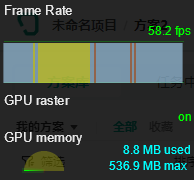
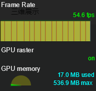
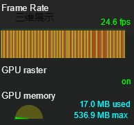
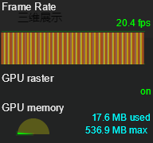
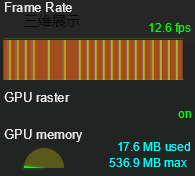
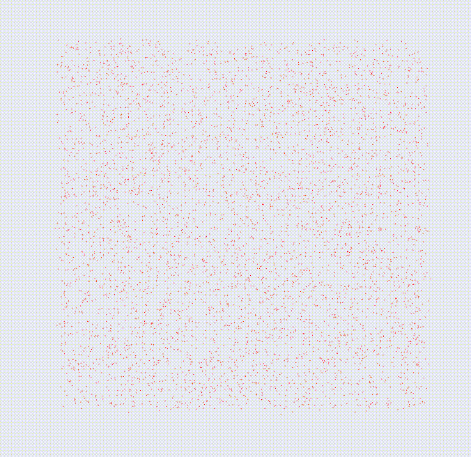

# Three.js 粒子效果

标签：`Three.js` `ShaderMaterial` `粒子动效`

## 粒子创建

- `Canvas2D`：数据量大时，性能不佳
- `THREE.Points`：经典方式
- `THREE.Sprites`：因为需要创建多个对象，理论上性能不如 Points
- `Shader` 编程：能玩的很花，且性能最佳，但需要了解 webgl 相关图形学知识

## 粒子位置

- 随机：随机的位置、移动方向、移动速度等
- 针对形状归整图形，可通过参数方程进行采样
- 针对形状复杂图形，可通过加载模型，获取所有顶点的方式

## 粒子动画

- 形状 A 变换到形状 B
  - 明确速度 / 轨迹 / 加速度，确定好起止位置，通过补间动画的方式，进行位置移动
  - 可能存在的问题，点 A 到 A' 走了最远路径，看着效果没那么好
  - 多余粒子处理方式：取余后使粒子重叠、随机散落
- 整体转场：如形状 A 缩小消失，然后形状 B 放大消失
- 响应鼠标
  - 鼠标移动位置有波纹，炸开效果
  - 根据鼠标移动量调整相机
- 补间动画
  - `tween.js`
  - `GSAP`

## 粒子连线

- 距离判断：通过判断当前粒子和其他粒子的距离，满足某个范围时，建立连线。
- 缺点是计算量特别大，点的数量级增大时会出现严重的性能问题


## 实现方案

使用 `THREE.Points` + `Tween.js` 实践简易的粒子效果

> 50 ～ 60 FPS 的动画将会相当流畅
> 
> 30 ～ 50 FPS 之间的动画，因各人敏感程度不同，舒适度因人而异，
> 
> 30 FPS 以下的动画，让人感觉到明显的卡顿和不适感

### 方案一：更新 `Geometry`

``` typescript

import { Easing, Tween, update } from '@tweenjs/tween.js';

const PointNum = 10000;
const BoxSize = 300;
const Radius = 150;
const Duration = 3000;

const getRandomCubePs = (n: number) => {
  const ps: Vector3[] = [];
  const getRandom = () => Math.random() * BoxSize - BoxSize / 2;
  for (let i = 0; i < n; i += 1) {
    ps.push(new Vector3(getRandom(), getRandom(), getRandom()));
  }
  return ps;
};

const getRandomCubePoints = (ps: Vector3[]) => {
  const geo = new BufferGeometry().setFromPoints(ps);
  const material = new PointsMaterial({ color: 'red' });
  const points = new Points(geo, material);
  return points;
};

const getRandomSpherePs = (n: number) => {
  const ps: Vector3[] = [];
  const getRandom = () => (Math.random() - 0.5) * 2;
  while (ps.length < n) {
    const x = getRandom();
    const y = getRandom();
    const z = getRandom();
    const length = Math.sqrt(x * x + y * y + z * z);
    const ratio = (Radius / length) * Math.random();
    ps.push(new Vector3(x, y, z).multiplyScalar(ratio));
  }
  return ps;
};

const spherePs = getRandomSpherePs(PointNum);
const targetSpherePs = spherePs.map((item) => item.clone());
const cubePs = getRandomCubePs(PointNum);
const targetCubePs = cubePs.map((item) => item.clone());
const points = getRandomCubePoints(cubePs);


  useEffect(() => {
    editor.add(points);
    const updateFn = (val: Vector3[]) => {
      const geo = points.geometry;
      if (geo) {
        geo.setAttribute(
          'position',
          new Float32BufferAttribute(
            val.flatMap((item) => item.toArray()),
            3,
          ),
        );
        geo.getAttribute('position').needsUpdate = true;
        editor.render();
      }
    };
    const tween = new Tween(cubePs);
    const tweenBack = new Tween(cubePs);
    tween.to(targetSpherePs, Duration).easing(Easing.Exponential.InOut).onUpdate(updateFn);
    tweenBack.to(targetCubePs, Duration).easing(Easing.Exponential.InOut).onUpdate(updateFn);
    tween.chain(tweenBack);
    tweenBack.chain(tween);
    tween.start();
    const animate = (time?: number) => {
      const result = update(time);
      animationId.current = window.requestAnimationFrame(animate);
      if (!result) {
        window.cancelAnimationFrame(animationId.current);
      }
    };
    animate();
    return () => {
      points.removeFromParent();
      window.cancelAnimationFrame(animationId.current);
    };
  });

```
| 粒子数量 / 个 | 0                           | 5000                        | 8000                        | 10000                       | 15000                       | 20000                       | 30000                       |
| ------------- | --------------------------- | --------------------------- | --------------------------- | --------------------------- | --------------------------- | --------------------------- | --------------------------- |
| FPS           |  |  |  |  |  |  |  |

效果如下：
|             5000 个              |              50000 个              |
| :------------------------------: | :--------------------------------: |
|  |  |


上述方式超过 5000 个粒子时，性能下降非常明显，实时计算所有点的位置信息给 CPU 带来了很大的压力。

### 方案二：使用 `ShaderMaterial`

``` typescript

import {
  AdditiveBlending,
  BufferGeometry,
  Color,
  Float32BufferAttribute,
  Points,
  PointsMaterial,
  ShaderMaterial,
  Texture,
  Vector3,
} from 'three';
import { Easing, Tween, update } from '@tweenjs/tween.js';

const CubePointNum = 800000;
const SpherePointNum = 8000;
const BoxSize = 300;
const Radius = 150;
export const Duration = 3000;

const getRandomCubeGeom = (n: number) => {
  const ps: Vector3[] = [];
  const getRandom = () => Math.random() * BoxSize - BoxSize / 2;
  for (let i = 0; i < n; i += 1) {
    ps.push(new Vector3(getRandom(), getRandom(), getRandom()));
  }
  return new BufferGeometry().setFromPoints(ps);
};

const getRandomSphereGeom = (n: number) => {
  const ps: Vector3[] = [];
  const getRandom = () => (Math.random() - 0.5) * 2;
  while (ps.length < n) {
    const x = getRandom();
    const y = getRandom();
    const z = getRandom();
    const length = Math.sqrt(x * x + y * y + z * z);
    const ratio = (Radius / length) * Math.random();
    ps.push(new Vector3(x, y, z).multiplyScalar(ratio));
  }
  return new BufferGeometry().setFromPoints(ps);
};

const getTexture = (canvasSize = 64) => {
  const canvas = document.createElement('canvas');
  canvas.width = canvasSize;
  canvas.height = canvasSize;
  canvas.style.background = 'transparent';
  const context = canvas.getContext('2d')!;
  const gradient = context.createRadialGradient(
    canvas.width / 2,
    canvas.height / 2,
    canvas.width / 8,
    canvas.width / 2,
    canvas.height / 2,
    canvas.width / 2,
  );
  gradient.addColorStop(0, '#fff');
  gradient.addColorStop(1, 'transparent');
  context.fillStyle = gradient;
  context.beginPath();
  context.arc(canvas.width / 2, canvas.height / 2, canvas.width / 2, 0, Math.PI * 2, true);
  context.fill();
  const texture = new Texture(canvas);
  texture.needsUpdate = true;
  return texture;
};

const getPointsMaterial = () => new PointsMaterial({ color: 'red' });

const getShaderMaterial = () => {
  const uniforms = {
    // 顶点颜色
    color: {
      type: 'v3',
      value: new Color(0xffffff),
    },
    // 传递顶点贴图
    itemTexture: {
      value: getTexture(),
    },
    // 传递 axis 值，用于 shader 计算顶点位置
    axis: {
      value: 1,
    },
  };
  const material = new ShaderMaterial({
    uniforms,
    vertexShader: `attribute vec3 memoPs;
    uniform float axis;
    void main() {
        vec3 vPos;
        // 变动的 val 值引导顶点位置的迁移
        vPos.x = position.x * axis + memoPs.x * (1. - axis);
        vPos.y = position.y * axis + memoPs.y * (1. - axis);
        vPos.z = position.z * axis + memoPs.z * (1. - axis);
        vec4 mvPosition = modelViewMatrix * vec4( vPos, 1.0 );
        gl_PointSize = 4.;
        gl_Position = projectionMatrix * mvPosition;
    }`,
    fragmentShader: `uniform vec3 color;
    uniform sampler2D itemTexture;
    void main() {
        gl_FragColor = vec4( color, 1.0 );
        gl_FragColor = gl_FragColor * texture2D( itemTexture, gl_PointCoord );
    }`,
    blending: AdditiveBlending,
    depthTest: false,
    transparent: true,
  });
  return material;
};

const getMemoPs = (origin: BufferGeometry, target: BufferGeometry) => {
  const originPs = origin.getAttribute('position').array;
  const targetPs = target.getAttribute('position').array;
  const [more, less] =
    originPs.length > targetPs.length ? [originPs, targetPs] : [targetPs, originPs];
  // 根据最大的顶点数开辟数组空间，同于存放顶点较少的模型顶点数据
  const memoPs = new Float32Array(more.length);
  // 先把顶点较少的模型顶点坐标放进数组
  memoPs.set(less);

  for (let i = less.length, j = 0; i < more.length; i += 1, j += 1) {
    j %= less.length;
    memoPs[i] = less[j];
    memoPs[i + 1] = less[j + 1];
    memoPs[i + 2] = less[j + 2];
  }
  return memoPs;
};

export const cubeGeom = getRandomCubeGeom(CubePointNum);
export const sphereGeom = getRandomSphereGeom(SpherePointNum);
export const shaderMaterial = getShaderMaterial();
export const pointsMaterial = getPointsMaterial();
export const memoPs = getMemoPs(cubeGeom, sphereGeom);
cubeGeom.setAttribute('memoPs', new Float32BufferAttribute(memoPs, 3));
export const cube = new Points(cubeGeom, shaderMaterial);

export const axis = { value: 0 };
... ...

  useEffect(() => {
    editor.getCameraControls().setEnableRotate(true);
    editor.add(cube);
    editor.render();
    const updateFn = (val: { value: number }) => {
      if (!cube) {
        return;
      }
      cube.material.uniforms.axis = val;
      editor.render();
    };
    const tween = new Tween(axis);
    const tweenBack = new Tween(axis);
    tween.to({ value: 1 }, Duration).easing(Easing.Exponential.InOut).onUpdate(updateFn);
    tweenBack.to({ value: 0 }, Duration).easing(Easing.Exponential.InOut).onUpdate(updateFn);
    tween.chain(tweenBack);
    tweenBack.chain(tween);
    tween.start();
    const animate = (time?: number) => {
      const result = update(time);
      animationId.current = window.requestAnimationFrame(animate);
      if (!result) {
        window.cancelAnimationFrame(animationId.current);
      }
    };
    animate();
    afterRenderFn();
    return () => {
      cube.removeFromParent();
      window.cancelAnimationFrame(animationId.current);
    };
  });
  
```

| 粒子数量 / 万个 | 0    | 50   | 100  | 200  | 500  | 800  | 1000 |
| --------------- | ---- | ---- | ---- | ---- | ---- | ---- | ---- |
| FPS             | 59.4 | 59.4 | 59.4 | 59.4 | 45.0 | 33.0 | 27.6 |


一百万个效果如下：

<div align="center">

</div>

改为通过 `ShaderMaterial` 实现后，充分利用 GPU 的计算能力，当粒子数量达到两百万时仍然可以保证页面的流畅性，性能提升巨大。

## 参考资料

- [threejs+tweenjs 实现 3D 粒子模型切换 ](https://juejin.cn/post/6844903669305966600)
- [ 腾讯 UP2017 3D 粒子效果在网页端实现 ](https://github.com/liunnn1994/TencentUp2017?tab=readme-ov-file)
- [3D 粒子效果在网页端实现分享 ](https://tgideas.qq.com/gicp/news/475/6515254.html?from=list)
- [sketch of three.js](https://ykob.github.io/sketch-threejs/)
- [particle-love](https://particle-love.com/)
- [Three.js 粒子特效 ](https://juejin.cn/post/6844903615438553096#heading-18)
- [3DPoints](https://github.com/youngdro/3DPoints)
