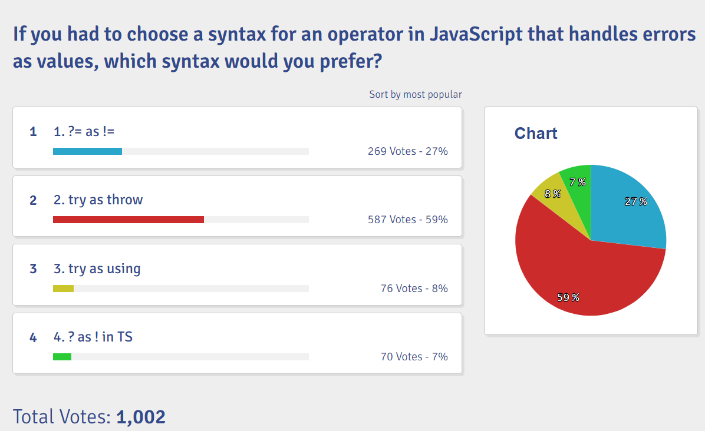

# Javascript 安全赋值运算符提案

标签：`Javascript` `try/catch` `?=`

## 介绍

新的 ECMAScript 标准中有一个提案是关于错误处理的 , 使用 `?=` 安全赋值运算符简化错误处理的方式 , 让你的代码更简约更干净 , 提高可读性。
`?=` 运算符背后的模式受到 Go、 Rust 和 Swift 等语言中类似构造的启发

## `try/catch` 用法

传统的用用 `try/catch` 进行错误处理示例如下

```js
try {
  // do something
} catch (error) {
  console.error(error);
}
```

虽然可以有效地防止应用崩溃 , 但当需要按顺序执行多个操作且每个操作都有自己的错误处理时，这种方法可能会导致深度嵌套的代码

## `promise.catch` 错误捕获

随着 Promise 的引入，错误处理变得更加清晰

示例如下

```js
fetchData()
  .then((data) => onSuccess)
  .catch((error) => onError)
  .finally(() => onFinally);
```

通过链式调用 , 解决了嵌套的问题 , 但是如果需要处理多个错误的时候 , 会带来大量模板代码

## `?=` 运算符

新的安全赋值运算符的使用方式示例如下

```js
const [error, result] = ?= fn();

// 对于异步操作
const [error, data] = ?= await fetchData();

// 处理错误
if(error){
  // handle error
}
```

- 如果执行成功 ,`error` 将返回 `null` 或 `undefined`,`result` 返回执行结果
- 如果执行失败 ,`error` 将返回错误对象 ,`result` 返回 `undefined`

此语法消除了对 `try/catch` 块带来的代码嵌套的问题 , 同时也避免了链式调用带来的模板代码

## 总结

新的 `?=` 运算符相比于过去传统的错误处理方式有以下几点优势

- 提高代码可读性
- 减少模板代码
- 显式的声明了 `error` , 方便提醒开发者及时错误处理 , 提高代码安全性

但由于是新的语法提案 , 即使最后通过了 , 短时间内的兼容性必定不会太好 , 未来可期

并且社区内对于该提案的反响一般 , 出现很多质疑声，主要的一些观点是

- 不必要的复杂性 , 学习成本增加
- 传统的错误处理方式真的很糟糕吗
- 对于性能的影响



## 参考

- [Discussion: Preferred operator/keyword for safe assignment](https://github.com/arthurfiorette/proposal-safe-assignment-operator/issues/4)