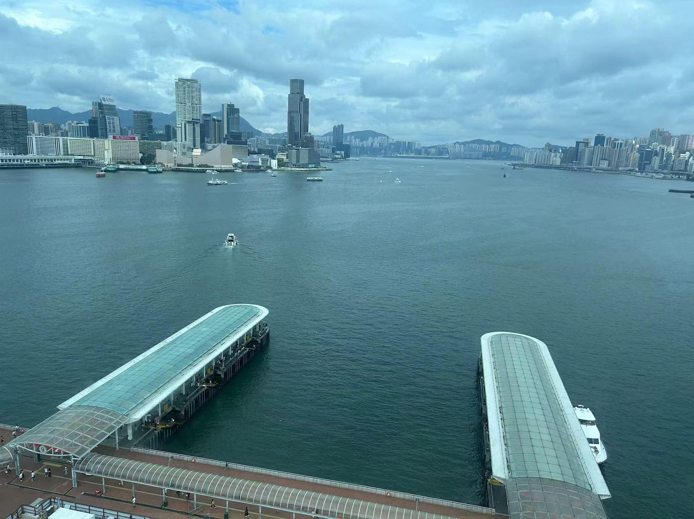
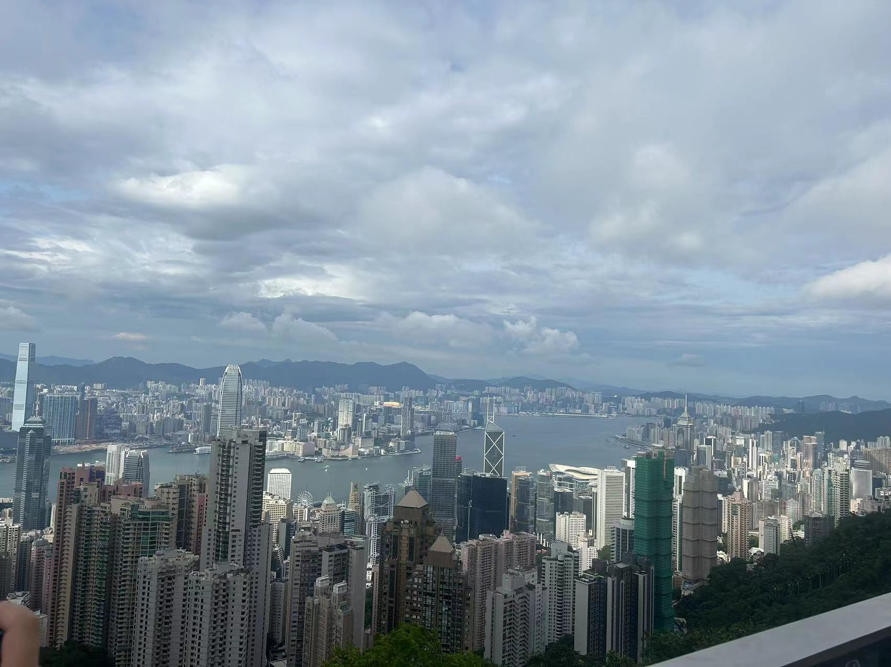

# 香港特种兵

其实也是突发奇想，没有做什么计划，前一天和朋友吃饭的时候聊天突然说去香港，那就说走就走

实际上 23 年的时候也去过一次了，算得上轻车熟路，攻略的话小红书上一抓一大把，也不需要准备太多

计划是一日内往返，时间充裕的话期望走一下上次没去的 `麦理浩径` 第二段的路线

## 清单

- 签注过的港澳通行证，
- 支付宝上买的一天境外流量包，过关后开启漫游选择运营商 `CMHK`
- 纯净水，因为香港的水真的很贵
- 两三百港币，口岸过关的时候可以兑换，其实除去打车需要，基本上都支持支付宝

## 路线

算是比较经典的一日游路线，附上不精确时间线

- `9:00` 深圳福田口岸过关
- `10:00` 落马洲地铁到旺角东吃吃逛逛，地铁费用 40 港币 😱 ，这一段换运营商会断网
- 途径油麻地，避坑油麻地警署，堪比鼓浪屿最美转角 💀 ，而且去的时候还在施工
- `12:00` 地铁到尖沙咀看维多利亚港
- `13:00` 坐船去中环坐摩天轮， 20 港币可以坐 3 圈，约 15 分钟，但是排了一小时的队 😢

- `14:00` 本来准备乘公交去 `麦理浩径` 徒步一段，上了双层巴士后听说终点是太平山顶，也是个不错的地方，就一路坐到底了
  - `麦理浩径` 说是最美海岸线 ( 之一，因为深圳也有个最美海岸线 hhh) 感觉需要特意花一天去才行，位置在香港郊区
  - 敞篷观光双层巴士票价太贵了，白天成人 200 港币
- `16:00` 太平山顶可以俯瞰整个香港 🙌 ，在山顶商场里吃了个冰室，一杯美式两块午餐肉一个煎蛋配一碗米饭售价 65 港币 

- `17:00` 巴士下山转地铁出关，两小时后回到福田口岸

## 建议

- 香港没什么不好，就是物价贵，理性消费，真要说有多好玩其实也不是
- 百度地图会不太好使，高德地图和谷歌地图好像还行，但也会有延迟
- 带个充电宝，香港插座不太一样，移动电源也比较少