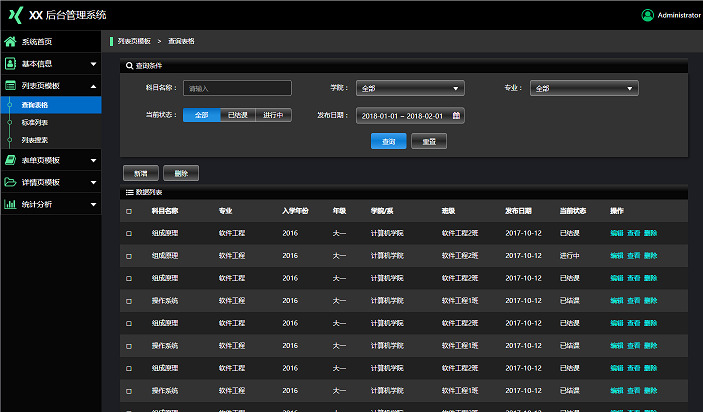

# 组件库

开发组件库的背景有两个：
- 作为低代码的物料注入到低代码平台使用
- 以公司业务为核心，以自研组件库为基础，统一 UI 风格并提高代码复用率

## 典型场景

以比较典型的**后台管理系统**为例，本身各个系统间页面同质化程度非常高。

需要应对的业务都是简单数据的增删改查，初次以来便是数据的可视化展示。

总结来看，八成以上的组件都是围绕着输入框，表单，表格这几个基础组件做封装。



## 典型组件

- 文件上传下载
- 远程数据下拉选择框
- 表单项联动
- 模糊搜索输入框
- 高阶搜索表单
- 表格列显隐控件

## 解决方案

**80/20法则：优先覆盖 80% 高频业务场景**

### 技术选型

使用 Vue 还是 React 完全取决于部门技术栈，能用 Typescript 就用

### 构建方式

关于打包构建工具的选择，vite 在这个场景下的优势不大，虽然 rollup 的 Tree Shaking 做得更好。

但是业务组件通常会涉及到图片，字体图标这些静态资源，综合来看 webpack 会比 rollup 更好一点。

### 发布方式

简单一点的方案是单包发布，所有组件发在一个 npm 包里。

```js
- project
  - build              // 打包构建
  - docs               // 文档
  - packages           // 组件代码存放目录
    - common           // 通用工具库
      - utils          // 函数库
    - UploadButton     // 组件1
      - index.vue      
    - GridColumnFilter // 组件2
      - index.vue      
  - script             // 脚本命令
```

如果是追求使用者极致的体验可以通过 monorepo 的方式管理组件，每个组件单独发布。

为此，应做好 git tag 的管理，并在发布时同步更新 `CHANGELOG.md`

### 组件文档

组件文档编写的方式有很多种

- VuePress，VitePress
- 飞书文档
- StoryBook

个人会比较推荐 `StoryBook`，功能十分强大，最明显的优点是能够让你实时查看不同配置下的效果

需要重点说明的是

- 组件功能
- 组件核心应用场景的使用示例
- 属性
  - 类型
  - 默认值
  - 可选值
  - 函数入参
  - 文字说明
- 事件，方法，插槽等
  
需要记录好组件各个版本间的新功能的增加，旧问题的修复

### 单元测试

单元测试推荐使用 [Jest](https://jestjs.io/docs/getting-started)，保证代码覆盖率 80%(个人标准) 以上

最好是将测试自动化，比如利用 git hook，保证每次提交代码时执行测试，保证测试通过才能提交成功

如果是使用 `Vite` 打包的话也可以考虑 `Vitest`，推荐看看 [Vitest 与其他测试框架对比](https://cn.vitest.dev/guide/comparisons.html)

### 其他

- 国际化
- 主题定制