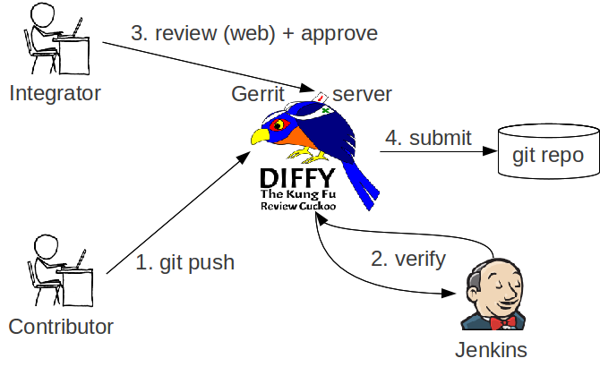

# Husky

背景是开发组件库的过程中，想使用 husky 配置 git hooks 以实现在 git push 时自动执行单元测试

保障每次提交后组件功能均正常 work，因此在组件库中引入了 husky，但是我们使用了 Gerrit 做代码版本管理

## 关于 Gerrit

它的工作流程如下图所示



从 Gerrit 上拉取代码时会同时使用 scp 执行一个命令，在 git hooks 下生成一个 **commit-msg** 文件，可以在仓库的 `.git/hooks` 下看到

这个文件的作用是为每次 commit 生成一个 changeId，这个 **changeId** 对于 Gerrit 来说非常重要

如果没有这个 **changeId**，是没有办法 push 到远程分支的

## 问题

在安装了 husky 后发现每次 commit 时无法自动生成 **changeId** 了，以至于 push 失败

## 原因

经查证发现时 husky install 时改变了 githooks 文件的目录，可以发现 `git config core.hooksPath` 从之前的 `.git/hooks` 变成了 `.husky`

这就导致了上述的 **commit-msg** 不再执行，因此也无法生成 **changeId**

## 解决思路

### 方案一

将 **commit-msg** 需要执行的逻辑移动到 `.husky` 目录下

但是这样的复制无法预防之后 **commit-msg** 发生变动后带来的问题，所以感觉并不是最好的方案

根本原因还是 husky 直接改了 git 的配置

### 方案二👍

发现了另一个更轻量级 hooks 工具 [simple-git-hooks](https://github.com/toplenboren/simple-git-hooks) ⭐1.4k

它具备几个特点：

- 零依赖
- 只需要在 package.json 内简单配置即可
- 轻量级

  | Package                       | Unpacked size | With deps |
  | ----------------------------- | ------------- | --------- |
  | husky v4 `4.3.8`              | `53.5 kB`     | `~1 mB`   |
  | husky v8 `8.0.3`              | `6.44 kB`     | `6.44 kB` |
  | pre-commit `1.2.2`            | `~80 kB`      | `~850 kB` |
  | **simple-git-hooks** `2.11.0` | `10.9 kB`     | `10.9 kB` |

并且不会像 husky 直接修改 git 的配置，使用方式也非常简单

#### 安装

```shell
npm install simple-git-hooks --save-dev
```

### json 配置

在 package.json 内配置

```json
"scripts": {
  // 每次 npm install 时执行
  "postinstall": "simple-git-hooks"
},

"simple-git-hooks": {
  "pre-commit": "npx lint-staged",
  "pre-push": "cd ../../ && npm run format",

  // All unused hooks will be removed automatically by default
  // but you can use the `preserveUnused` option like following to prevent this behavior

  // if you'd prefer preserve all unused hooks
  "preserveUnused": true,

  // if you'd prefer preserve specific unused hooks
  "preserveUnused": ["**commit-msg**"]
}
```

### 配置文件

除了在 package.json 内直接配置，你也可以像 eslint 那样使用配置文件

```JS
// .simple-git-hooks.js
module.exports = {
  "pre-commit": "npx lint-staged",
  "pre-push": "npm run format",
};
```

### 手动执行

可以手动执行来更新 .git/hooks

```shell
npx simple-git-hooks
```