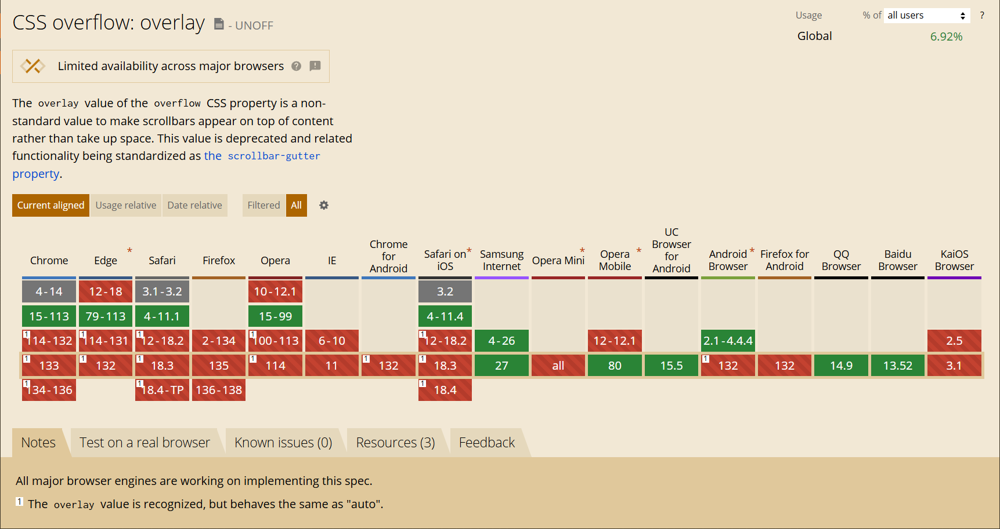

# 滚动条问题

在内容超出容器大小时使用 overflow: auto 或者 overflow: visible 会显示滚动条，大部分情况下这是合理的。

但同时带来的副作用是可能会导致容器宽度发生变化破坏布局

在之前开发中，一直使用了 `overflow: overlay` 来实现 hover 后显示滚动条的效果

它能使滚动条绘制在内容之上，有效的规避了布局被破坏的问题

```css
.scroll() {
  overflow: hidden;

  &:hover {
    /* 如果不支持 overlay 降级成 auto 方案 */
    overflow: auto;
    overflow: overlay;
  }
}
```

但是最近发现它失灵了，滚动条会一直显示并占据容器空间，经查阅是已经被废弃了




## 作用

`overflow: overlay` 是一个非标准的 CSS 属性值，最初由 WebKit 内核的浏览器（如旧版 Chrome 和 Safari）引入。

它的行为类似于 `overflow: auto`，即在内容溢出时显示滚动条。但与 `auto` 不同的是，`overlay` 会将滚动条绘制在内容之上，而不是占据布局空间。


## 被废弃

尽管 `overflow: overlay` 在某些场景下非常有用，但它最终被废弃，在社区里面查了一下，应该主要原因是它本身就不是一个标准属性，未被纳入 CSS 规范，只是 WebKit 内核浏览器的私有实现。

这导致了浏览器兼容性问题，其他浏览器（如 Firefox） Web 标准的不断发展，浏览器厂商更倾向于支持符合规范的 CSS 属性。

但是感觉挺多争议的声音在 ([Do not remove overflow: overlay](https://github.com/w3c/csswg-drafts/issues/6090))

并且也影响到了一些主流的组件库，如 ant-design [ 🐛 [BUG]](https://github.com/ant-design/pro-components/issues/6162)


## 替代方案

也搜集了社区里提供的解决方案

- caniuse 推荐使用 scrollbar-gutter 做替代，有开发者做了对比可以参考：[Prevent unwanted Layout Shifts caused by Scrollbars with the scrollbar-gutter CSS property](https://www.bram.us/2021/07/23/prevent-unwanted-layout-shifts-caused-by-scrollbars-with-the-scrollbar-gutter-css-property/)，结论是 scrollbar-gutter 是通过预留滚动条的空间来解决内容晃动问题的，而不是将滚动条覆盖在内容之上，所以还是有区别
- 第二种是使用一些第三方滚动组件 ([react-scrollbars-custom](https://github.com/xobotyi/react-scrollbars-custom))，以修改 dom 的方式实现滚动条，这种感觉是被普遍接受了的，虽然不如 overlay 来的方便，但能有效的规避布局破坏的问题
