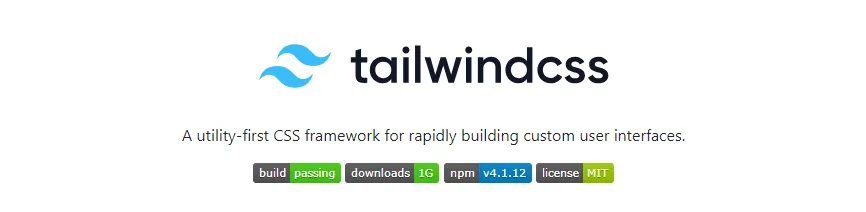
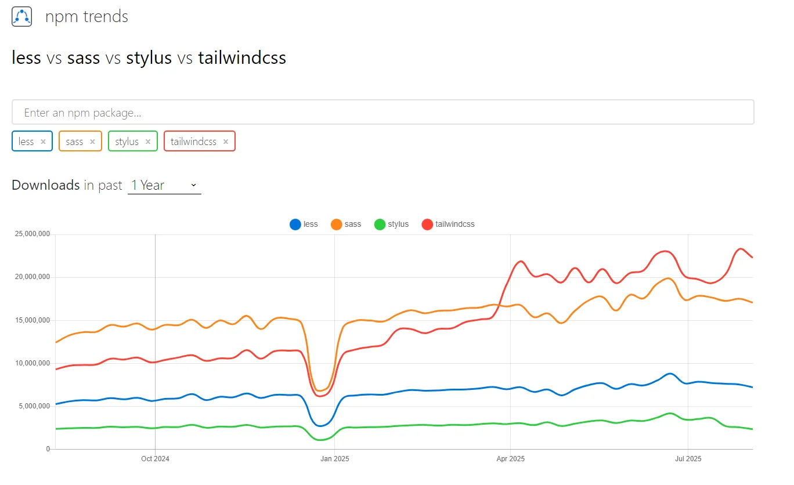
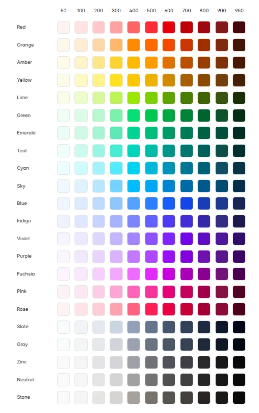

# 关于 Tailwind CSS 4.0


## 入门篇


看一下近几年比较热门的 CSS 框架————Tailwind CSS，简单过了一遍 4.0 的官方文档，以此记录一下。

对比几个流行的 CSS 预处理器，可以看到 Tailwind 已逐渐成为趋势，目前 Github 拥有 `89.6k ✨`



其使用示例如下：

```jsx
<div class="flex flex-col items-center gap-6 p-7 md:flex-row md:gap-8 rounded-2xl">
  <div>
    
  </div>
  <div class="flex items-center md:items-start">
    <span class="text-2xl font-medium">Class Warfare</span>
    <span class="font-medium text-sky-500">The Anti-Patterns</span>
    <span class="flex gap-2 font-medium text-gray-600 dark:text-gray-400">
      <span>No. 4</span>
      <span>·</span>
      <span>2025</span>
    </span>
  </div>
</div>

```

### 安装
如果是使用 vite 打包项目，需要做以下几步

#### 装依赖
```shell
npm install tailwindcss @tailwindcss/vite
```

#### 配置 vite
```typescript
// vite.config.ts
import { defineConfig } from 'vite'
import tailwindcss from '@tailwindcss/vite'
export default defineConfig({
  plugins: [
    tailwindcss(),
  ],
})
```

#### 导入
```css
@import "tailwindcss";
```

### 编辑器配置
因为 Tailwind CSS 使用了一些自定义的 CSS 语法，如 `@theme`，`@variant`，`@source`，所以为了让你的开发编辑器不抛出警告，所以它还配套了一些插件。

如果是使用 VS Code 可以在插件市场安装官方插件 [Tailwind CSS IntelliSense](https://marketplace.visualstudio.com/items?itemName=bradlc.vscode-tailwindcss)，该插件提供了自动补全，语法高亮以及 lint 提示，并且鼠标悬浮时会提示完整的 CSS 定义。

除此之外也提供了 Prettier 插件 —— [prettier-plugin-tailwindcss](https://github.com/tailwindlabs/prettier-plugin-tailwindcss)，可以以官方推荐的 class 顺序进行格式化。

### 兼容性
#### 浏览器兼容性
Tailwind CSS v4.0 部分核心功能依赖于以下版本的浏览器：

+ Chrome 111 (released March 2023)
+ Safari 16.4 (released March 2023)
+ Firefox 128 (released July 2024)

如果你的目标用户的浏览器低于上述版本，可能需要考虑使用低版本的 Tailwind CSS

#### 对比预处理器
与 Sass，Less，Stylus 这些 CSS 预处理器完全不同，它可以完全取代这些工具。并且具备以下几点特性：

+ 如果你使用 `@import` 导入 CSS 文件， Tailwind CSS 会在打包时将被引入的内容自动内联当前文件，无需再使用 `postcss-import`
+ 现代浏览器均已支持 CSS 变量， Tailwind CSS 底层也十分依赖于此，所以你也放心的使用 CSS 变量
+ 底层使用 [Lightning CSS](https://github.com/parcel-bundler/lightningcss) 处理 CSS 嵌套
    - Lightning CSS：一个使用 Rust 实现的高效的 CSS 解析器、转换器、打包器和压缩工具
+ 由于你的大部分样式都会声明在 HTML 文件内，所以你无需想方设法甚至使用循环来预定义样式，Tailwind CSS 会帮你按需生成
+ 你可以直接使用 Tailwind 提供的颜色调色板
+ 

#### CSS 模块化
Tailwind 可以与模块化的 CSS 共存，但是并不建议这么做，原因如下：

+ 模块化 CSS 主要用于解决作用域问题，而使用 Tailwind 时并不存在这个问题
+ 打包工具都是分开处理 CSS 模块，如果你有 50 个 CSS 模块，Tailwind 就需要执行 50 次，会带来性能问题
+ 如果通过 CSS 模块引入，无法直观的看到上下文中所有定义好的 class，更推荐使用 CSS 变量

#### 框架内使用
针对 Vue，Svelte，Astro 此类支持 `<style>` 标签的框架，为避免上述 CSS 模块带来的缺陷，官方建议不再使用样式标签

这么看来它与 Vue 此类强调 **关注点分离** 的框架并不契合，倒是和 React 比较适配

## 核心概念
### 使用工具类
先看一个例子

```jsx
<div class="mx-auto flex max-w-sm items-center gap-x-4 rounded-xl bg-white p-6 shadow-lg outline outline-black/5 dark:bg-slate-800 dark:shadow-none dark:-outline-offset-1 dark:outline-white/10">
  
  <div>
    <div class="text-xl font-medium text-black dark:text-white">ChitChat</div>
    <p class="text-gray-500 dark:text-gray-400">You have a new message!</p>
  </div>
</div>

```

尽管上述的样式定义与传统的实践方式不一，但是一旦上手会你会发现很多优点：

+ 效率提升：缓解命名焦虑，你不在苦恼于命名 class，使用 CSS 选择器，不用再在 HTML 和 CSS 文件之间来回切换
+ 安全性：可以放心的修改而不必担心其他页面的复用问题
+ 可维护性：接手旧项目时也不必记住所有自定义 CSS，因为根本没有
+ 轻便：可以很轻易地复制粘贴到另一个项目，HTML 和 CSS 在一起
+ CSS 停止膨胀：这些类都是可复用的，意味着你不再需要声明新的 class

#### 为什么不使用行内样式
可能从某些角度上看，这种方式很像直接写行内样式，但其实使用工具类有很多好处相比于行内样式：

+ 使用行内样式时，每个数字都是 Magic Number 缺少约束，工具类更容易搭建统一且协调的 UI
+ 行内样式无法作用于 hover 态，focus 态，但是 Tailwind 提供的工具类可以做到
+ 行内样式无法实现媒体查询，Tailwind 可以轻易实现响应式页面

#### 工具类（Utility classes）
##### 伪类
可以使用 `hover:`，`focus:`，`disabled:` 此类变体（variants）添加对应的伪类

```jsx
<button class="bg-sky-500 hover:bg-sky-700 ...">Save changes</button>

```

##### 媒体查询
可以使用 `sm:`，`md:`，`lg:` 等变体（variants）实现响应式设计

```jsx
<div class="grid grid-cols-2 sm:grid-cols-3">
  <!-- ... -->
</div>

```

| Breakpoint prefix | Minimum width  | CSS                             |
| ----------------- | -------------- | ------------------------------- |
| sm                | 40rem (640px)  | @media (width >= 40rem) { ... } |
| md                | 48rem (768px)  | @media (width >= 48rem) { ... } |
| lg                | 64rem (1024px) | @media (width >= 64rem) { ... } |
| xl                | 80rem (1280px) | @media (width >= 80rem) { ... } |
| 2xl               | 96rem (1536px) | @media (width >= 96rem) { ... } |


##### 暗黑模式
可以使用 `dark:` 等变体（variants）实现暗黑模式切换

```jsx
  <h3 class="text-gray-900 dark:text-white">Writes upside-down</h3>

```

##### 类组合
可能存在同个 CSS 属性需要多个 class 共同配置的情况，如 `filter` 属性

```jsx
<div class="blur-sm grayscale">
  <!-- ... -->
</div>

```

这两个类最终都会作用在 `filter` 上，最终编译产物如下：

```css
.blur-sm {
  --tw-blur: blur(var(--blur-sm));
  filter: var(--tw-blur,) var(--tw-brightness,) var(--tw-grayscale,);
}
.grayscale {
  --tw-grayscale: grayscale(100%);
  filter: var(--tw-blur,) var(--tw-brightness,) var(--tw-grayscale,);
}
```

其它的如 `gradients`，`transforms` 也类似

##### 使用任意值
大部分工具类使用定义好的主题变量，但同时你也可以使用方括号语法指定为任意值

```jsx
<button class="bg-[#316ff6] ...">
  Sign in with Facebook
</button>

```

如果任意值内包含空格，需要替换为下划线如：

```jsx
<div class="grid grid-cols-[1fr_500px_2fr]">
  <!-- ... -->
</div>

```

由此可以看出，Tailwind 并不仅仅是提供了一张静态的样式表，它会根据你所使用的 class 来生成最终的 CSS

##### 复杂的选择器
```jsx
<button class="dark:lg:data-current:hover:bg-indigo-600 ...">
  <!-- ... -->
</button>

```

以上类名最终会被编译成以下 CSS

```css
@media (prefers-color-scheme: dark) and (width >= 64rem) {
  button[data-current]:hover {
    background-color: var(--color-indigo-600);
  }
}
```

###### 选择父元素
选择父元素时需要给父元素添加 `group` 类，子元素使用工具类时带上 `group-` 的前缀，如 `group-focus`, `group-active`,

```jsx
<a href="#" class="group rounded-lg p-8">
  <!-- ... -->
  <span class="group-hover:underline">Read more…</span>
</a>

```

```css
@media (hover: hover) {
  a:hover span {
    text-decoration-line: underline;
  }
}
```

###### 选择子元素
可以使用方括号语法定义任意变体，以使用子元素选择器，兄弟元素选择器等

```jsx
<div class="[&>[data-active]+span]:text-blue-600 ...">
  <span data-active><!-- ... --></span>
  <span>This text will be blue</span>
</div>

```

```css
div > [data-active] + span {
  color: var(--color-blue-600);
}
```

##### 什么时候推荐用内联样式
+ CSS 属性是一个变量如

```jsx
export function BrandedButton({ buttonColor, textColor, children }) {
  return (
    <button
      style={{
        backgroundColor: buttonColor,
        color: textColor,
      }}
      className="rounded-md px-3 py-1.5 font-medium"
    >
      {children}
    </button>
  );
}
```

+ 需要定义 CSS 变量

```jsx
export function BrandedButton({ buttonColor, buttonColorHover, textColor, children }) {
  return (
    <button
      style={{
        "--bg-color": buttonColor,
        "--bg-color-hover": buttonColorHover,
        "--text-color": textColor,
      }}
      className="bg-(--bg-color) text-(--text-color) hover:bg-(--bg-color-hover) ..."
    >
      {children}
    </button>
  );
}
```

##### 如何复用
当你完全使用工具类样式搭建项目时，你必然会发现有许多频繁出现的样式组合，例如

```jsx
<div class="mt-3 flex -space-x-2 overflow-hidden">
  
  
  
  
  
</div>

```

有几种思路可以帮助你进行优化

+ 使用循环做列表渲染，如 Vue 的 `v-for`，React 的 `map()`
+ 使用 IDE 提供的多光标功能快捷修改
+ 封装成组件
+ 当然可以封装成公用 class，但官方还是不建议你这么干

#### 处理样式冲突
如果两个 class 拥有同样的 CSS 属性，依据出现在样式表中的顺序，后者会覆盖前者。

通常情况下，你不应该将多个一样的 CSS 属性作用于元素上，如果需要由外部修改组件内样式，更推荐以 props 的方式传递配置

```jsx
export function Example({ gridLayout }) {
  return <div className={gridLayout ? "grid" : "flex"}>{/* ... */}</div>;
}
```

##### !important 修饰符
```jsx
<div class="bg-teal-500 bg-red-500!">
  <!-- ... -->
</div>

```

##### 命名冲突
如果项目已有的一些 class 与 Tailwind 提供的工具类有命名冲突，你可以给工具类加前缀

```css
@import "tailwindcss" prefix(tw);
```

会得到以下编译后的 CSS

```css

/* ... ... */
.tw-text-left {
  text-align: left;
}

/* ... ... */
```

使用方式如下：

```jsx
<div class="tw-text-lg md:tw-text-xl tw-bg-red-500 hover:tw-bg-blue-500">
  <!-- -->
</div>

```

### 主题变量
当然你也可以自定义自己的主题，如字体，颜色等

#### 自定义变量
```css
@import "tailwindcss";
@theme {
  --color-mint-500: oklch(0.72 0.11 178);
}
```

此时，你便可以使用 `bg-mint-500`，`text-mint-500` 等工具类，直接在行内样式里使用该变量也是可以的

#### @theme
`@theme` 是 tailwind 的特殊指令，此时定义的 css 变量不仅仅是 css 变量，还会指导 tailwind 创建新的工具类

注意在最顶层定义这些变量，避免嵌套

如果是直接使用 `:root` 定义的变量就不会生成对应的工具类

不仅仅是生成工具类，在某些命名空间下，还可以用于生成相关的变体，如 `--breakpoint-*`

```css
@import "tailwindcss";
@theme {
  --breakpoint-3xl: 120rem;
}
```

这样定义后可以直接使用 `3xl:` 变体用于响应式设计

```jsx
<div class="3xl:grid-cols-6 grid grid-cols-2 md:grid-cols-4">
  <!-- ... -->
</div>

```

一些常见的命名空间如下：

| NameSpace       | Utility classes          |
| --------------- | ------------------------ |
| --color-*       | bg-red-500，text-sky-300 |
| --font-*        | font-sans                |
| --text-*        | text-xl                  |
| --font-weight-* | font-bold                |


正是因为导入 `tailwindcss` 后它本身通过 `@theme` 定义了许多 css 变量，所以你可以直接使用 `bg-red-200` 这样常用的工具类

你也可以使用同名的变量进行覆盖

#### 在 JS 中访问
可以通过以下方式在 Javascript 中访问到定义的 CSS 变量

```javascript
const styles = window.getComputedStyle(document.documentElement);
const shadow = styles.getPropertyValue("--shadow-xl");
```

### 自定义样式
除去之前提到了可以使用方括号语法定义任意值，主题变量定制主主题。你可能还需要给项目添加一些基本样式。

推荐使用 `@layer` 指令将基本样式添加到 base 层

```css
@layer base {
  h1 {
    font-size: var(--text-2xl);
  }
  h2 {
    font-size: var(--text-xl);
  }
}
```

如果想对一些复杂的类，如组件库样式进行修改，推荐将此类样式添加到 components 层

```css
@layer components {
  .card {
    background-color: var(--color-white);
    border-radius: var(--radius-lg);
    padding: --spacing(6);
    box-shadow: var(--shadow-xl);
  }
}
```

此时任可以使用 tailwind 提供的变体进行定义，如：

```css
.my-element {
  background: white;
  @variant dark {
    background: black;
  }
}
```

等价于

```css
.my-element {
  background: white;
  @media (prefers-color-scheme: dark) {
    background: black;
  }
}
```

### 检测原理
Tailwind 的工作原理是扫描项目中所有的的工具类，然后根据你实际使用的类生成所有必要的 CSS。这样既保证了最终的 CSS 产物最小，也允许你使用任意值的工具类。

#### 如何检测
Tailwind 将你的所有源文件视为纯文本，并且不会尝试以任何方式将你的文件解析为代码。

他只会在 class 中筛选出任何可能成为类的标记，并根据这些类生成 CSS。

所以它并不支持动态类名，如：

```jsx
<div class="text-{{ error ? 'red' : 'green' }}-600"></div>

function Button({ color, children }) {
  return <button className={`bg-${color}-600 hover:bg-${color}-500 ...`}>{children}</button>;
}
```

正确的做法是：

```jsx
<div class="{{ error ? 'text-red-600' : 'text-green-600' }}"></div>
function Button({ color, children }) {
  const colorVariants = {
    blue: "bg-blue-600 hover:bg-blue-500",
    red: "bg-red-600 hover:bg-red-500",
  };
  return <button className={`${colorVariants[color]} ...`}>{children}</button>;
}
```

#### 检测哪些文件
Tailwind 会扫描项目中所有文件，除了：

+ `.gitignore` 忽略的问题
+ `node_modules` 中的三方依赖
+ 二进制文件，如图片，视频等
+ CSS 文件

但它提供了 `@source` 指令可以允许你显示的增加/忽略需要扫描的文件

```css
@import "tailwindcss";
/* 新增 */
@source "../node_modules/@acmecorp/ui-lib";
/* 忽略 */
@source not "../src/components/legacy";
```

默认情况下，他从项目根目录开始递归扫描，但可以使用 `source` 函数指定扫描起点，这在一些 monorepos 中很有用

```css
@import "tailwindcss" source("../src");
```

## 小结
纵观 CSS 发展史，大概经历了以下三个阶段

+ 原始阶段：需要什么写什么，此时还没有成熟的管理方案
+ 组件化：随着 CSS 模块化的发展及组件化开发的兴起，有意的将频繁出现的样式组合进行封装，方便复用，这也是目前 `element`，`antd` 等主流组件库的的统一做法
+ 原子化/零件化：虽然是组件化，但是每个样式组件仅对应单一的 CSS 属性，前端工具链的成熟，对开发体验的追求等等因素推动了 Tailwind CSS 的诞生
    - 并且在此之上衍生出了 `shadcn-ui` 此类组件库

而 Tailwind CSS 的优势在于

+ 开发效率得提升，不再需要写 class，不再苦恼于 class 的命名，过去一直强调 BEM 格式的命名约定
+ 提供一套专业的设计规范，能有效的约束开发人员的同时又可以高度定制，允许配置任意值
+ 天然支持响应式设计及暗黑模式
+ 最小的 CSS 体积，性能最佳

另外一点，它非常适合 AI 编写，语法规则简单，并且提供了有限的工具类作为素材，生成后的代码因为没有分离的 CSS 文件，所以也非常方便修改。

## 参考资料
+ [CSS Utility Classes and "Separation of Concerns"](https://adamwathan.me/css-utility-classes-and-separation-of-concerns/)

