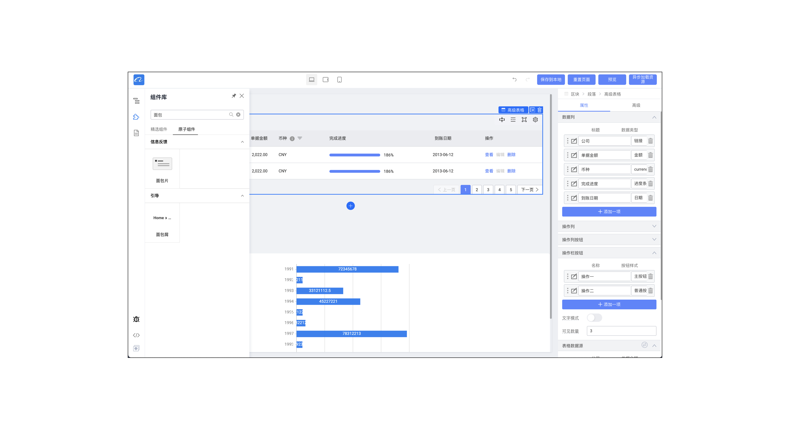

# 低代码痛点

接触了一段时间的低代码后，深刻的感受到了这玩意的痛点，当然，它确实是有它能大展身手的场景，但是这个局限性也很大。

## 背景

它的出现很大一部分原因是由于产品的标准化趋势，功能页面整体抽象统一，以至于能将大部分需求整合出一个标准的模板。

各部门间的业务交叉，并且对定制化需求不高，适用于 B 端产品，后台系统。

## 反响

其实同事对低代码的反响并不好，提到就皱眉甚至嗤之以鼻。

接触过实际低代码项目的人都被深深的毒害过，吐槽的最多的就是“功能实现不了，只能想其他办法”。

## 降本增效

比如一个简简单单增删改查页面，附加一点点的业务逻辑。期望是通过低代码平台附带一点胶水代码能够快速完成。

个人感觉如果是熟练的工程师，用主流框架开发前后端是不到一周的工作量，包括开发联调测试。

但是碍于低代码平台提供的能力受限，这一点点的业务逻辑在开发时无限阻塞，以至于影响整体项目进度。

再加上自研的低代码存在种种缺陷，比如物料不全，平台 bug，预览效果不佳，测试调试困难等等障碍。

以至于大多数事件都在和低代码平台开发人员 battle，沟通成本大大增加。

并且由于是自研框架，没有输出系统性的，完整的使用文档，上手成本非常大，基本上是需要有一个懂的人手把手教才会玩。

## 低代码缺陷

抛开上述主观因素而言，其实使用下来能感受到低代码本身也存在一些缺陷：

- 无法实时预览
  - 异步数据，异步操作
  - 组件初始化/挂载生命周期钩子内的参数
  - 鼠标事件，hover，click
- 代码与平台高度耦合，无法脱离宿主环境
- 定制能力很差，一旦出现超出平台能力的业务需求，成本会很大
- 性能问题，取决于出码器的能力，很难人为调优
- 技术债务，平台帮开发者屏蔽了技术细节，一旦出现问题或平台有破坏性更新，很难修复
- 平台开发者和项目开发者间协作成本陡增

## 思考

感觉低代码能否被有效应用，需要各个相关部门间达成共识，最好是产品，开发，UI，测试能一起去接受平台的能力。

并在需求确定时，以平台能力为边界，明确什么能做什么还不能做，不至于最后因为平台的缺陷导致开发加班加点返工。

不仅仅是低代码吧，所有业务中台的发展都需要各个部门间的理解和支持，产品不能天马行空，UI 也得符合标准，这样才能有比较良性的协作。

## 补充

感觉这玩意不可能造成失业，因为低代码开发人员也是需要一定的技术能力，才能驾驭的住平台的使用。

所谓的胶水代码一定是需要懂技术的人员才能实现的，甚至比普通开发人员的门槛要高。