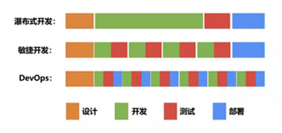

# 软件开发模式

## 瀑布开发

整个软件开发流程严格遵循需求、设计、开发、测试和部署几个阶段。在这个流程中，需要等上 一个阶段工作完成后，才会进行下个阶段的工作。例如：开发工程师会把需求的代码全部开发好，才给到测试人员进行验证，最后交给运维工程师部署上线。

## 敏捷开发

敏捷开发”是把原有模式下的大需求拆分成多个小需求，并采用小步快跑的方式进行开发与迭代，原来的一个大环改为一个个小的闭环。

## DevOps

一种重视“软件开发人员（Dev）”和“IT运维技术人员（Ops）”之间沟通合作的文化、运动或惯例。

通过自动化“软件交付”和“架构变更”的流程，来使得构建、测试、发布软件能够更加地快捷、频繁和可靠。

可以说，`DevOps `的出现正是为了打破开发和运维人员之间的壁垒，让两者得以更加通畅的沟通，以清除部门间存在的对立。

`DevOps`完善了敏捷开发存在的短板，实现了真正的闭环。

在 `DevOps` 的模式下，开发和运维都不再是“孤立”的团队，两者会在软件的整个生命周期内相互协作，并在工作中得到紧密地配合。

`DevOps` 的成功实现也离不开工具的支持。这其中就包括最重要的自动化 CI/CD 流水线，通过自动化的方式打通软件从构建、测试到部署发布的整个流程，还有包括实时监控、事件管理、配置管理、协作平台等一系统工具的的配合

## 参考资料

- [研发管理中“瀑布式开发”与“敏捷开发”的区别是什么](https://cloud.tencent.com/developer/news/1057710)
- [一文讲清瀑布开发、敏捷开发和DevOps](https://zhuanlan.zhihu.com/p/603537380)