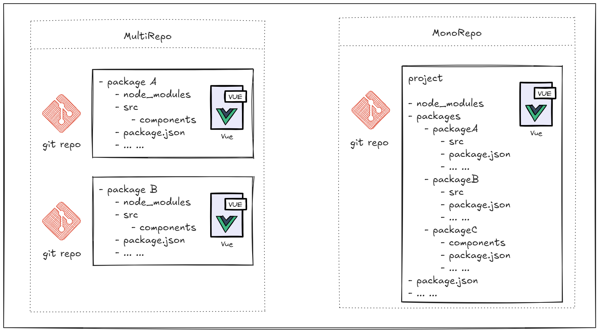
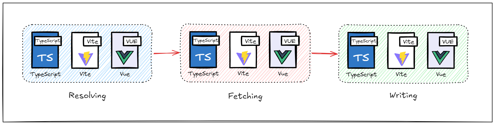
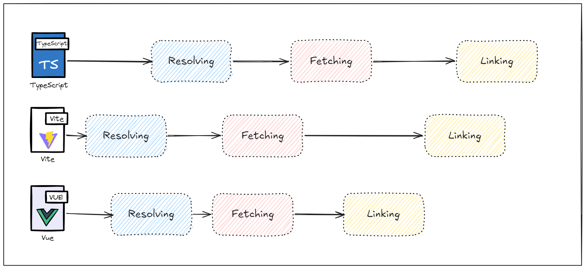
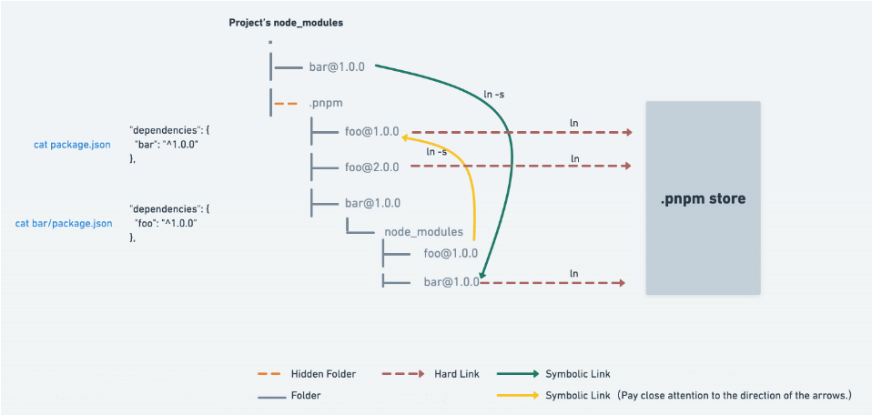

# 关于 MonoRepo

MonoRepo 是目前比较流行的一种项目代码管理方式，指的是在一个仓库中管理多个 package。

React，Vue，Vite 等开源项目目前都采用这种方式，与之相对的是 MultiRepo 即每个仓库对应一个 package。



## MultiRepo 的劣势

- 上层包想要体验最新的底层包版本，需要逐层升级部署，重新安装依赖，过程非常繁琐。
- 每个包的工程化配置具有很多相似之处，各自有很多复制粘贴的配置部分，一旦有团队性的配置修改，需要逐个更新。

## MonoRepo 经典目录结构

常见的前端 MonoRepo 项目的目录结构可以是这样

```
my-awesome-MonoRepo/
├── .git/
│
├── packages/        
│   ├── shared-ui/          # 共享的 UI 组件库
│   ├── common-utils/       # 通用的工具函数
│   ├── hooks/              # 通用的工具函数
│   └── app1/               # 项目
│   └── app2/               # 项目
│
├── tsconfig.json
├── babel.config.js
├── eslint.config.js
├── .gitignore
└── pnpm-workspace.yaml     # (如果使用 pnpm) 任务管理配置文件
└── package.json            # 根 package.json, 用于管理工作区和脚本
```

## 优点

MonoRepo 有以下几点优势

- 代码共享和复用
- 工程配置统一
- 依赖管理优化
- 构建部署方便

### 代码共享和复用

在 MonoRepo 的结构下，你可以将所有项目中的公共组件，公共函数，一切公共模块抽成一个或多个 package。

方便所有上层 package 使用，并且统一做修复和拓展，版本更新后能立即体验，无需发布新版本后再更新依赖。

这样也有助于团队成员执行模块化开发，组件化开发，降低代码耦合度。

### 工程配置统一

如 Eslint，Prettier，CommitLint 等工程化配置可在顶层进行配置，统一代码质量和代码风格，修改方便。

### 依赖管理

使用 MultiRepo 时，每个 package 需要下载各自的 node_modules。

如果你有多个 Vue 项目，那么你本机的磁盘里就会有多个 Vue 需要的依赖，重复的三方依赖存在极大的空间浪费。

在 MonoRepo 中，通过依赖提升的方式能够将相同版本的依赖提升至顶层 package，每个同版本依赖只安装一次。

### 构建部署

在 MultiRepo 中如果 package 间存在依赖关系，部署时需要严格按照特定的顺序修改版本及部署。

在 MonoRepo 中可以使用相关的工具对部署进行编排调度，实现一键构建，一键部署。

## 缺点

关于 MonoRepo 的缺点被诟病最多的是，由于多个项目在一个 git 仓库中，所以难以进行项目粒度的权限分配。

除了权限之外还包括：

- 幽灵依赖：因为依赖被扁平化，会出现非法依赖访问的问题，即 package 能够引入未在 package.json 声明的依赖
- 依赖安装耗时长：安装时依赖时需要安装所有 package 的依赖
- 构建打包耗时长：项目间存在依赖关系时串行构建或全量构建增加构建时间

## MonoRepo 方案

为解决上述问题，可以借助一些开源方案进行优化。

常见方案包括

- yarn/pnpm + workspace
- [Lerna](https://www.lernajs.cn/)
- [Nx](https://nx.dev/docs/getting-started/intro)
- [Turborepo](https://turbo.net.cn/docs)

这里简单介绍 pnpm + workspace 这种方案。

### 为什么是 pnpm

主流的三款包管理工具 npm7+、yarn、pnpm 都已经原生支持 workspace 模式，但是 npm 和 yarn 都存在一些历史遗留问题

- 扁平化依赖算法复杂，性能开销大，串行安装速度慢
- 多个 MonoRepo 存在时，大量三方依赖需要重复下载，磁盘空间浪费
- NPM 分身：指的是对于相同依赖的不同版本，由于 hoist 的机制，只会提升一个，其他版本则可能会被重复安装
- 幽灵依赖

#### 安装提速

传统的依赖安装过程按顺序经过以下步骤



- Resolving：解析依赖树，确定哪些安装包需要下载
- Fetching：通过网络请求下载压缩过的依赖包
- Writing：解压安装包

为了提升安装速度，pnpm 采用了并行安装的方式。



除了并行安装之外，pnpm 还将最后一步改成了 Linking 利用操作系统中的软硬链接节省空间。

#### 节省空间

pnpm 通过使用硬链接和符号链接（又称软链接）的方式来避免重复安装以及提高安装效率

- 硬链接（hard link）：电脑文件系统中的多个文件平等的共享同一个文件存储单元，特性是同步修改。
- 软链接（symbolic link）：包含一条以绝对路径或相对路径的形式指向其他文件或者目录的引用，无法修改

pnpm 首先将依赖安装到全局 store。

然后利用 `hard link` 将所需的包从从全局 store 硬连接到虚拟 store 的，这里的虚拟 store 指的是顶层的 `node_modules/.pnpm`。

虚拟 store 中的所有依赖都铺平了，并且通过 `symbolic link` 来组织依赖关系

附上官方的原理图：



通过上述方式，每个依赖在本机上仅会存在一份，剩下的都靠软硬链接来关联，极大程度节省了磁盘空间并提升了依赖安装速度。

### workspace

pnpm 通过 workspace 特性来支持 MonoRepo，workspace 指的是一个代码库管理多个 package 的能力。

它要求在代码仓库的根目录下存有 pnpm-workspace.yaml 文件指定哪些目录作为独立的工作空间，这个工作空间可以理解为一个子模块或者 npm 包

```yaml
packages:
  - 'packages/*'      # 匹配一级子目录
  - 'playground/**'   # 匹配所有子目录（递归）
```

如上配置会将 packages 目录下直接子目录以及 playground 所有嵌套子目录都声明为子模块。

在 workspace 模式下，项目根目录通常不会作为一个子模块或者 npm 包，而是主要作为一个管理中枢，可以执行一些全局操作，安装一些共有的依赖。

并且每个子模块都能访问根目录的依赖，适合把 TypeScript、Vite、eslint 等公共开发依赖装在这里。

## 小结

MonoRepo 相比于传统的代码管理方案，可以更便捷的复用各种模块，并且用很小的成本保证多个项目的技术栈统一。

但同时，由于模块会被多个项目复用，MonoRepo 对于开发者提出了更高的要求，如果没有做好模块间的隔离解耦，很容易写出难以维护的代码库。

对于那种手里有锤子，看什么都是钉子的氛围，MonoRepo 很可能带来更大的灾难。

但对于团队协作紧密，项目规模不大的开发场景下，能够很好的贯彻模块化开发的理念，提升开发效率。
