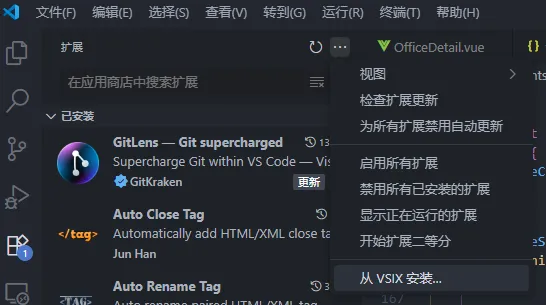
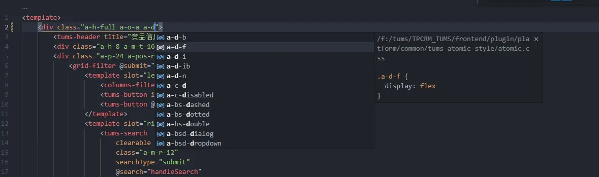

# VsCode 插件开发

## 背景

内部框架规定前端样式需使用预先定义好的原子类，但是开发过程中 VsCode 无法进行补全和提示。

为提升团队开发体验和开发效率，以开源插件 [IntelliSense for CSS class names in HTML](https://github.com/zignd/HTML-CSS-Class-Completion) 为基础进行二次开发。

主要拓展两个功能：

- 指定扫描和解析根目录下名称为 atomic.css 的原子类定义文件
- 针对 vue 文件在 class 中键入空格时提供 classname 补全及定义提示

## 构建

```shell
node -v
>> v18.20.8

vsce -v
>> 2.15.0

vsce package
```

## 使用方式

在 vscode 中选择扩展侧边栏，从 vsix 中安装，选择 classname-intellisense-1.0.0.vsix 文件，重启 vscode 即可生效



## 效果



## 其它插件

- HTML Class Suggestions：只能补全绑定的 class，且补全时看不到定义
- CSS Peek：可实现 classname 定义跳转
- IntelliSense for CSS class names in HTML：可以补全，但是看不到定义
- Class autocomplete for HTML：待考察


## 参考资料

[手把手教你写一个VSCode插件，从开发到发布全流程](https://zhuanlan.zhihu.com/p/1984534897763836357)