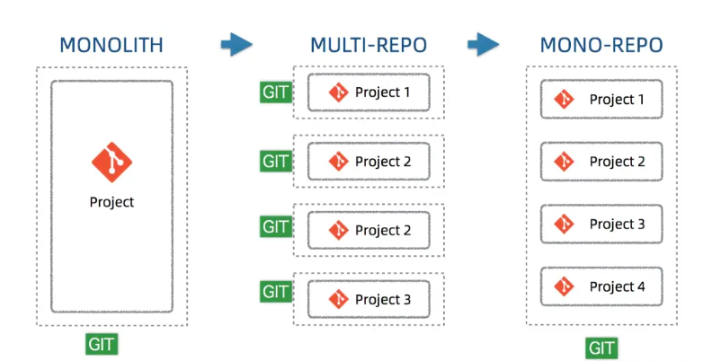

# monorepo

项目管理的三种经典模式

<div style="text-align:center">

</div>

## 单体应用开发

在软件开发的早期阶段，通常采用单体应用的开发模式。整个应用程序由一个单一的代码库、构建和部署流程组成。这种模式简单易懂，适合小型项目

### 优点

- 方便集成和部署，测试
- 方便代码复用
- 方便制定代码规范


### 缺点

- 代码维护性变差，随着功能以及代码量的大幅增加，代码功能耦合性增强。
- 构建时间过长，任何小修改必须重新构建整个项目，这个过程往往很长。
- 稳定性差，任意一个功能出现问题，可能导致整个应用挂掉

## 多仓多模块开发

将项目拆分为多个独立的仓库，每个仓库独立维护自己的代码和构建流程。这种模式更适合大型和复杂的项目，因为它提供了更好的隔离性和独立性，同时可以更灵活地管理多个团队的工作

### 优点

- 每一个项目都有一个独立的仓库，职责单一。
- 代码量和复杂性受控，项目由不同的团队独立维护、边界清晰。
- 单个项目也易于自治开发测试部署和扩展，不需要集中管理集中协调。
- 利于进行权限控制，可以针对单个仓库来分配权限，权限分配粒度比较细。


### 缺点

- 代码和配置很难共享
- 存储和构建消耗增加，多个项目依赖同个 package 会浪费本地磁盘内存
- 更新，启动麻烦

## 单仓多模块

允许在一个代码库中管理多个项目、组件或服务，提供更好的代码共享和重用性，现代的版本控制系统和工具链使得 Monorepo ，像 Pnpm、Yarn 、Lerna 和 Turborepo 等工具，它们提供了更好的管理、构建和部署多个项目的能力

### 优点

- 复用依赖，复用工作流，复用基础配置
- 模块独立管理，结构清晰
- 分工明确，业务场景独立


### 缺点

- 权限管理麻烦

## Workspaces

前端目前最主流的三款包管理工具 `npm7+`、`yarn`、`pnpm` 都已经原生支持 `workspaces` 模式,通过 `workspaces` 功能来支持 Monorepo 模式。workspaces 是指支持在一个代码库中最顶层管理多个项目或模块的能力。

```
// package.json
"workspaces": [ "packages/a", "packages/b" ]
```
可以实现：

- 代码结构组织：在 Monorepo 中，不同的项目或模块通常位于同一个代码库的不同目录中。包管理工具通过识别并管理这些目录结构，可以将它们作为独立的项目或模块进行操作。
  
- 共享依赖：Monorepo 中的不同项目或模块可以共享相同的依赖项。包管理工具可以通过在根目录中维护一个共享的依赖项列表，以确保这些依赖项在所有项目或模块中都可用。

- 交叉引用：在 Monorepo 中，不同项目或模块之间可能存在相互引用的情况。包管理工具需要处理这些交叉引用，以确保正确解析和构建项目之间的依赖关系。

- 版本管理：Monorepo 中的不同项目或模块可能具有不同的版本。包管理工具需要能够管理和跟踪这些版本，并确保正确地安装和使用适当的版本。

- 构建和测试：包管理工具需要支持在 Monorepo 中进行增量构建和测试。这意味着只有发生更改的项目或模块会重新构建和测试，而不需要重新构建和测试整个代码库
